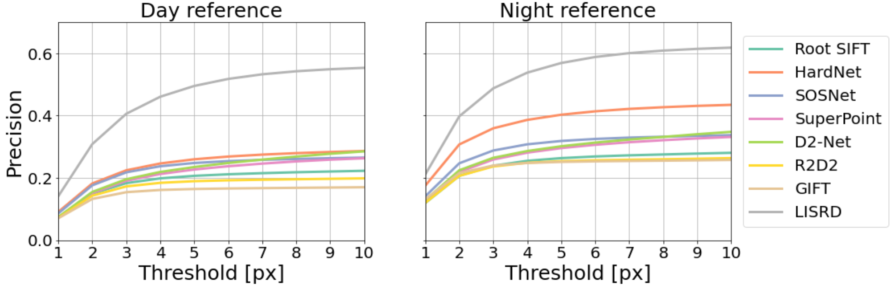

# LISRD - Local Invariance Selection at Runtime for Descriptors

This repository contains the implementation of the paper: [Online Invariance Selection for Local Feature Descriptors](https://arxiv.org/abs/2007.08988), R. Pautrat, V. Larsson, M. Oswald and M. Pollefeys (Oral at ECCV 2020).

LISRD offers the possibility to leverage descriptors with different invariances (e.g. invariant or variant to rotation and/or illumination) and to perform an online selection of the most adapted invariance when matching two images.

The following shows for example matches predicted with LISRD-SIFT that selects descriptors between SIFT (rotation invariant) and Upright SIFT (rotation variant):


## Usage

### Installation

We recommend using this code in a Python environment (e.g. venv or conda). The following script installs the necessary requirements and install the repository as a Python package locally:
```bash
make install
```

### Training your own model

All the training parameters should be present in a configuration file located in the folder `lisrd/configs`. The generic script to train your own model from the root folder is the following:
```bash
python -m lisrd.experiment train <path to your config file> <path to your experiment>
```

For example, training LISRD with the 4 types of invariance used in the paper would be:
```bash
python -m lisrd.experiment train lisrd/configs/lisrd.yaml ~/Documents/experiments/My_experiment
```
Use the config file `lisrd/configs/lisrd_sift.yaml` to instead train LISRD-SIFT that chooses between SIFT and Upright SIFT descriptors.

### Pretrained models

We provide two pretrained models:
- [lisrd_aachen](weights/lisrd_aachen.pth): version of LISRD used in the paper, trained on the [MS COCO](https://cocodataset.org) dataset, [Multi-Illumination Images in the Wild](https://projects.csail.mit.edu/illumination/) and [Aachen dataset images augmented with style-transfer or with optical flow information](https://github.com/naver/r2d2).
- [lisrd_vidit](weights/lisrd_vidit.pth): new version of LISRD, trained on the [MS COCO](https://cocodataset.org) dataset, [Multi-Illumination Images in the Wild](https://projects.csail.mit.edu/illumination/) and the [Virtual Image Dataset for Illumination Transfer (VIDIT)](https://github.com/majedelhelou/VIDIT). The results below are obtained using this model.

### How to use it

We provide a [notebook](notebooks/demo_lisrd.ipynb) showing how to use the trained models of LISRD. Additionally, `lisrd/export_features.yaml` is a script to export the LISRD descriptors with either SIFT or SuperPoint keypoints on a given folder of images. It can be used as follows:
```bash
python -m lisrd.export_features <path to the folder of images> <name of the model (lisrd or lisrd_sift)> --checkpoint <path to checkpoint> --keypoints <type of keypoints (sift or superpoint)> --num_kp <number of keypoints (default: 2000)>
```

## Results on the RDNIM dataset

The Rotated Day-Night Image Matching (RDNIM) dataset originates from the [DNIM dataset](http://users.umiacs.umd.edu/~hzhou/dnim) and has been augmented with homographic warps with 50% of the images including rotations. The images used for evaluation in the paper are available [here](https://www.polybox.ethz.ch/index.php/s/P89YkZyOfdhmdPN).

Comparison to the state of the art on the RDNIM dataset, using SuperPoint keypoints for all methods:

 <table style="width:100%">
  <tr>
    <th></th>
    <th colspan="3">Day reference</th>
    <th colspan="3">Night reference</th>
  </tr>
  <tr>
    <th></th>
    <th>Homography estimation</th>
    <th>Precision</th>
    <th>Recall</th>
    <th>Homography estimation</th>
    <th>Precision</th>
    <th>Recall</th>
  </tr>
  <tr>
    <td>Root SIFT</td>
    <td>0.121</td>
    <td>0.188</td>
    <td>0.112</td>
    <td>0.141</td>
    <td>0.238</td>
    <td>0.164</td>
  </tr>
  <tr>
    <td>HardNet</td>
    <td>0.199</td>
    <td>0.232</td>
    <td>0.194</td>
    <td>0.262</td>
    <td>0.366</td>
    <td>0.323</td>
  </tr>
  <tr>
    <td>SOSNet</td>
    <td>0.178</td>
    <td>0.228</td>
    <td>0.203</td>
    <td>0.211</td>
    <td>0.297</td>
    <td>0.269</td>
  </tr>
  <tr>
    <td>SuperPoint</td>
    <td>0.146</td>
    <td>0.195</td>
    <td>0.178</td>
    <td>0.182</td>
    <td>0.264</td>
    <td>0.255</td>
  </tr>
  <tr>
    <td>D2-Net</td>
    <td>0.094</td>
    <td>0.195</td>
    <td>0.117</td>
    <td>0.145</td>
    <td>0.259</td>
    <td>0.182</td>
  </tr>
  <tr>
    <td>R2D2</td>
    <td>0.170</td>
    <td>0.175</td>
    <td>0.162</td>
    <td>0.196</td>
    <td>0.237</td>
    <td>0.216</td>
  </tr>
  <tr>
    <td>GIFT</td>
    <td>0.187</td>
    <td>0.152</td>
    <td>0.133</td>
    <td>0.241</td>
    <td>0.236</td>
    <td>0.209</td>
  </tr>
  <tr>
    <td><b>LISRD (ours)</b></td>
    <td><b>0.253</b></td>
    <td><b>0.402</b></td>
    <td><b>0.440</b></td>
    <td><b>0.297</b></td>
    <td><b>0.484</b></td>
    <td><b>0.519</b></td>
  </tr>
</table>



## Bibtex

If you use this code in your project, please consider citing the following paper:
```bibtex
@InProceedings{Pautrat_2020_ECCV,
    author = {Pautrat, Rémi and Larsson, Viktor and Oswald, Martin R. and Pollefeys, Marc},
    title = {Online Invariance Selection for Local Feature Descriptors},
    booktitle = {Proceedings of the European Conference on Computer Vision (ECCV)},
    year = {2020},
}
```
